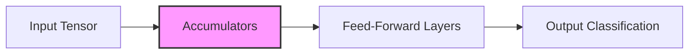

# SignalAccumulativeMLP

Welcome to the Signal Accumulative Model project, This repository contains a custom neural network model leveraging signal accumulation for preprocessing, designed for learning from sequential or streaming data. Below is an in-depth overview, setup guide, and usage instructions.

---

## Table of Contents

- [Introduction](#introduction)
- [Features](#features)
- [Architecture](#architecture)
- [Installation](#installation)
- [Quick Start](#quick-start)
  - [Training](#training)
  - [Validation](#validation)
  - [Saving and Loading Models](#saving-and-loading-models)
  - [Inference](#inference)
- [Data Handling](#data-handling)
- [Directory Structure](#directory-structure)
- [Future Improvements](#future-improvements)
- [License](#license)

---

## Introduction

Typical neural network architectures rely on either feed-forward layers or recurrent layers for handling sequential data. The SignalAccumulativeMLP introduces a different approach by storing state in a learnable accumulator. This can be useful when prior context is essential but you do not want the added complexity of standard recurrent or Transformer-based models.

Key points to note:
- Designed for streaming or sequential data.
- Uses accumulators to track historical signal.
- Includes decay factors to mitigate memory saturation.

---

## Features

- **Custom Accumulator**: Maintains signal values across batches with decay, simulating a memory of recent inputs.
- **Configurable Architecture**: Easily adjust layer sizes, dropout rate, and more for diverse tasks.
- **Easy to Extend**: Written in Python using PyTorch, allowing seamless integration with existing pipelines.
- **Robust Training Flow**: Includes a standard training loop with logging for loss and accuracy.
- **Save/Load Utilities**: Save model weights, configuration, and accumulator states for later use.

---

## Architecture



1. **Input Layer**: Accepts token-like or feature vectors of size equal to your `vocab_size`.
2. **Accumulator Buffer**: Stores signal across batches, updated after each forward pass with a user-defined decay factor.
3. **MLP Stack**: Multiple hidden layers (ReLU activations, dropout, etc.) culminating in a final classification layer.

---

## Installation

1. Clone the repository:
   ```bash
   git clone https://github.com/your-username/signal-accumulative-mlp.git
   cd signal-accumulative-mlp
   ```

2. Install necessary Python dependencies:
   ```bash
   pip install -r requirements.txt
   ```

3. Ensure you have a compatible version of Python (3.8+ recommended) and PyTorch installed.

---

## Quick Start

Below is a simple workflow demonstrating how to train, validate, and use the SignalAccumulativeMLP model.

### Training

```python
from stream_handler import StreamManager
from signal_accumulative_mlp import SignalAccumulativeMLP
import torch
import torch.nn as nn
import torch.optim as optim

def train(model, criterion, optimizer, train_loader, val_loader, n_epochs=10):
    for epoch in range(n_epochs):
        model.train()
        total_loss = 0.0
        correct, total = 0, 0

        for inputs, targets in train_loader:
            inputs, targets = inputs.to(model.device), targets.to(model.device)
            optimizer.zero_grad()
            outputs = model(inputs)
            loss = criterion(outputs, targets)
            loss.backward()
            optimizer.step()

            total_loss += loss.item() * inputs.shape[0]
            _, predicted = torch.max(outputs, dim=1)
            correct += (predicted == targets).sum().item()
            total += targets.size(0)

        avg_loss = total_loss / (len(train_loader.dataset))
        accuracy = correct / total
        print(f"Epoch [{epoch+1}/{n_epochs}] | Train Loss: {avg_loss:.4f} | Train Acc: {accuracy:.2%}")

        # Validation step
        validate(model, criterion, val_loader)

def validate(model, criterion, val_loader):
    model.eval()
    total_loss = 0.0
    correct, total = 0, 0

    with torch.no_grad():
        for inputs, targets in val_loader:
            inputs, targets = inputs.to(model.device), targets.to(model.device)
            outputs = model(inputs)
            loss = criterion(outputs, targets)
            total_loss += loss.item() * inputs.shape[0]
            _, predicted = torch.max(outputs, dim=1)
            correct += (predicted == targets).sum().item()
            total += targets.size(0)

    avg_loss = total_loss / (len(val_loader.dataset))
    accuracy = correct / total
    print(f"Validation Loss: {avg_loss:.4f} | Validation Acc: {accuracy:.2%}")

def main():
    # Instantiate StreamManager
    stream_manager = StreamManager()

    # Generate training data
    x_train, y_train = stream_manager.get_torch_batches(
        num_streams=4, 
        sequence_length=200
    )
    train_loader = stream_manager.load_data(4, x_train, y_train)

    # Generate validation data
    x_val, y_val = stream_manager.get_torch_batches(
        num_streams=4, 
        sequence_length=50
    )
    val_loader = stream_manager.load_data(4, x_val, y_val)

    # Initialize the model
    model = SignalAccumulativeMLP(
        vocab_size=stream_manager.get_vocab_size(),
        num_streams=4,
        accumulator_decay=0.9
    )

    # Setup loss and optimizer
    criterion = nn.CrossEntropyLoss()
    optimizer = optim.Adam(model.parameters(), lr=0.001)

    # Move to GPU if available
    model.device = torch.device('cuda' if torch.cuda.is_available() else 'cpu')
    model.to(model.device)

    # Start training
    train(model, criterion, optimizer, train_loader, val_loader, n_epochs=10)

if __name__ == '__main__':
    main()
```

### Validation

The `validate` function is integrated into the above `train` function. It calculates validation loss and accuracy at the end of each training epoch.

### Saving and Loading Models

```python
# Saving the model
model.save_model("models/signal_model_v1.pt")

# Loading the model
loaded_model = SignalAccumulativeMLP.load_model("models/signal_model_v1.pt", device="cpu")
loaded_model.eval()
```

### Inference

Use the model for inference on new data:

```python
# Reset accumulators before each new sequence
loaded_model.reset_accumulators()

# Your new data, shaped [batch_size, vocab_size]
new_signal_batch = torch.randn(4, loaded_model.input_size).to(loaded_model.device)

with torch.no_grad():
    outputs = loaded_model(new_signal_batch)
    _, predictions = torch.max(outputs, dim=1)

print("Predictions:", predictions)
```

---

## Data Handling

All data management is handled by the `StreamManager` class. It:
1. Generates random or custom data.
2. Assigns labels (targets) as needed.
3. Packages data into DataLoader-compatible structures.

This allows you to cleanly separate data logic from model logic, making the code more maintainable and flexible.

---

## Directory Structure

Below is a recommended directory layout:

```
signal-accumulative-mlp/
├── README.md
├── stream_handler.py
├── signal_accumulative_mlp.py
├── requirements.txt
├── main.py
└── models/
    └── (saved_models_here)
```

- **`signal_accumulative_mlp.py`**: Contains the `SignalAccumulativeMLP` class definition.
- **`stream_handler.py`**: Contains the `StreamManager` class for data generation/handling.
- **`main.py`**: Entry point for training and testing the model.
- **`models/`**: Directory to store saved model checkpoints.

---

## Future Improvements

1. **Hyperparameter Tuning**: Add grid search or Bayesian optimization to find the optimal decay rate, hidden layer sizes, and learning rate.  
2. **Variable Batch Sizes**: Enable flexible accumulator resizing if batch sizes change dynamically.  
3. **Multi-class Support**: Model is easily extendable to multi-class classification beyond the current default.  
4. **Advanced Monitoring**: Integrate TensorBoard or similar visualization tools for better insights.

---

## License

This project is licensed under the [Apache 2.0 License](LICENSE). Feel free to modify and distribute under these terms.
